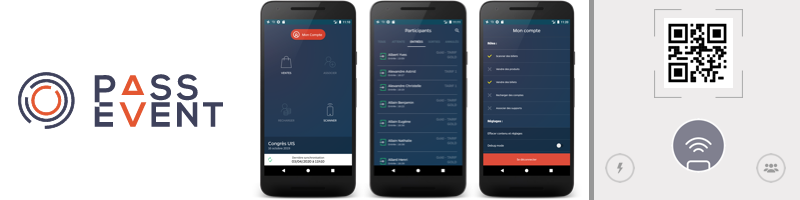



Software engineer since 8+ years, I currently work at [Getaround](https://fr.getaround.com/) in the Product & Engineering team where I contribute to building a car-sharing service to change the way we use cars. I love building good products and being a team player. 

I worked in various business area such as weather forecast, cartography, bank, events management, medical or mobility. I enjoy sharing knowledge with my team and I had the opportunity to be a speaker at some local events and conferences in order to share more widely. I have focused more on mobile in recent years, but I am curious to work and learn on everything related to software and product developement.

If you want to learn more on my professional experiences you can have a look on my [Linkedin](https://www.linkedin.com/in/rboulard/) or you can contact me by [Twitter](https://twitter.com/_renaudb), [Linkedin](https://www.linkedin.com/in/rboulard/) or email at *boulard.renaud-at-gmail-dot-com*. I'm open to chat on topics related to dev/product/tech or new work opportunities, I will get back to you within 24 hours.

#### Some products I worked on:

### Drivy 

Drivy was the largest car-sharing service in Europe, acquired by [Getaround for $300 million](https://techcrunch.com/2019/04/24/getaround-acquires-european-car-rental-platform-drivy-for-300-million/) in April 2019. I currently work at Getaround where I'm contributing to create great mobile apps to change the way we used cars.

-------------

### Paylib at Worldline

A mobile contactless (NFC) payment SDK branded as [Paylib](https://www.paylib.fr/paiement-sans-contact/) and integrated in banks apps such as BNP Paribas, Hello bank!, La Banque Postale, Société Générale, use by several millions of customers .

-------------

### 360 medics 

[360 medics](https://360medics.com/) is an app that helps caregivers committed to excellence in care.
Already 300 000 health professionals use it, 1 young doctor out of 2 in France daily!

-------------

### PassEvent

A service to help organization of events, covering ticket scanning, online ticketing, tailor-made organization and management of the cash register. I worked on the mobile application. Use to manage events with more than 1000 attendees.

-------------

### Météofrance

Weather forecast website : [Météo France](http://www.meteofrance.com/) is the French national meteorological service ~2 million daily visits. I was involved in a complete rebuild of the platform with in a team of ~15 developers.

[//]: # ##### Company I worked with or I'm currently working with

*Thank You for reading!*
